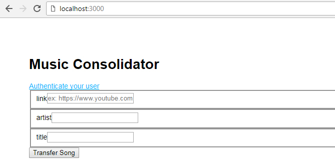

# Music Consolidator
Tired of having your music all over the place? Me too.

This script transfers a song from Youtube to your Google Music account, so you can
listen to all the music you like, in one location.

## Installation
Run `sudo ./install.sh`.

And install either `ffmpeg` or `avconv` on your machine.

## Usage
You can host a server by running `cd music_consolidator && npm start`, which will be accessible on `localhost:3000`.

This calls the underlaying script, but you may also use it directly, as such:

`consolidate.py --link "https://www.youtube.com/watch?v=LIlZCmETvsY" --artist "サカナクション" --title "新宝島"`
